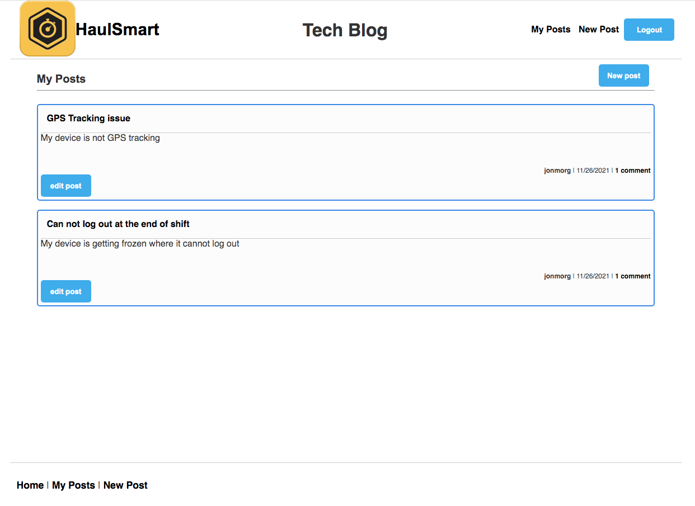

# Tech Blog

# Table of Contents

- [Description](#description)
- [Link](#link)
- [Screenshots](#screenshots)
- [License](#license)

# Description

This application called Tech Blog uses the Model-View-Controller paradigm, utilising Node.js and Express.js on the back end for saving and retrieving blog comments stored in a mySQL database. Other dependencies include express-handlebars, sequelize, bcrypt and

# Link

[Tech Blog: Click to get started](https://tech-blog-hs.herokuapp.com/)

# Screenshots

# License

MIT
